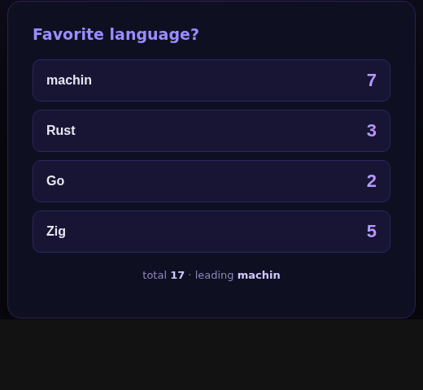

# boilerplate-cli-ui-machin-isomorphic

A starting point for **isomorphic web apps in machin** — a single static native
binary that is a **CLI**, an **HTTP server**, a **JSON API**, and serves its own
**reactive WebAssembly UI**. No Node, no bundler, no `node_modules`; the whole app
(server, client, and shared model) is MFL.

The example is a live poll: server-rendered for first paint, then **hydrated** by a
wasm client where signals + templating drive surgical DOM updates.



## What it demonstrates

| concern | how |
|---|---|
| **CLI** | `flags` framework — `./machin-poll --port 8080`, auto `--help` |
| **SSR** | machweb renders the poll HTML server-side (works with JS off) |
| **single binary serves its own wasm** | `GET /app.wasm` → `ok_wasm(read_file_bytes("app.wasm"))` |
| **JSON API** | `GET /api/results`, `POST /api/vote?o=N` |
| **reactive client** | `reactive` framework — signals, a computed total, templating |
| **isomorphic hydration** | the server's `data-s` spans are *reused* by the client (no re-render) |
| **shared code** | `models.src` (the poll schema) is compiled into **both** server and client |

The single binary is both ends of the wire, in one language.

## Architecture

```
                 ┌── src/models.src ──┐         (shared: options, labels)
                 │                    │
  src/reactive.src ─ src/client.src ──┴─ machin --target wasm ─▶ app.wasm  (the SPA)
                                                                    │ served by ↓
  src/machweb.src ─ src/flags.src ─ src/styles.src ─ src/server.src ┴─ machin ─▶ ./machin-poll
                                                       (web/host.js embedded as host_js)
```

- **`src/models.src`** — the schema (poll options + labels), the one source of
  truth shared by server and client.
- **`src/client.src`** — the reactive UI (wasm). Holds the vote state in machin
  signals; `vote(i)` updates optimistically and asks the host to `POST`.
- **`src/server.src`** — the CLI + machweb routes; holds the authoritative state
  and **SSR-renders** the poll with `data-s` span names that match the client's
  slots, so the client **hydrates** that exact DOM.
- **`web/host.js`** — the generic ~25-line JS host (instantiate wasm, wire the
  reactive runtime's DOM ops, seed from the SSR page, hydrate, forward clicks). It
  is **app-agnostic** — embedded into the binary at build time; adding components
  changes only the MFL.

The hydration contract is just the `data-s` names: the server renders
`<span data-s="opt_0">5</span>`, the client's `slot("opt_0", …)` binds to it. First
paint is server HTML; once the wasm loads it takes over with surgical patches (a
vote repaints only that option's count + the total).

## Build & run

Needs `machin` (**v0.55.0+**) and [`zig`](https://ziglang.org) (the C→wasm compiler).

```sh
./build.sh                 # → ./app.wasm and ./machin-poll
./machin-poll              # serves http://localhost:48096/
./machin-poll --port 8080  # …or another port;  --help for flags
```

## Make it your own

- **A new dynamic value:** add `slot("name", func(){ return str(…) })` to the
  client's `start()` and a matching `<span data-s="name">` in the server's
  `ssr_app()`.
- **A list:** use `list("id", keys, item)` (keyed reconciliation) instead of fixed
  slots — see [machin-web-demo-reactive](https://github.com/javimosch/machin-web-demo-reactive).
- **A route / API:** add a branch in `handle(req)` returning `ok_json(...)` /
  `ok_html(...)`.
- **Shared logic:** put anything both ends need in `models.src`.

> The frameworks under `src/` (`machweb`, `flags`, `reactive`) are vendored from
> [machin/framework](https://github.com/javimosch/machin/tree/main/framework). The
> reactive copy here adds `hydrate` and a value-embedding `slot` (initial paint
> with no flash). See the [web north star](https://github.com/javimosch/machin/blob/main/docs/NORTH-STAR-WEB.md).

## License

MIT
